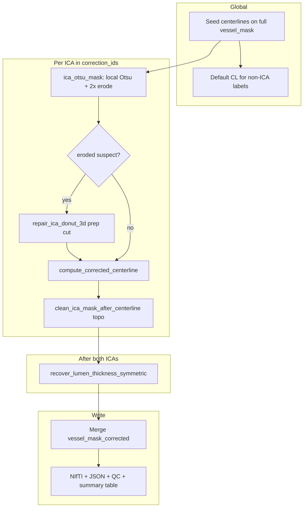

# ICA siphon centerline correction — methodology

This document describes the production module
[`src/nvitk/morphology/centerline_siphon.py`](../../src/nvitk/morphology/centerline_siphon.py)
(`nvitk.morphology.centerline_siphon`). It corrects **Internal Carotid Artery (ICA)**
centerlines and **ICA lumen masks** on TOF MRA when the cavernous siphon closes into a
false donut (partial-volume merge of the hairpin limbs).

The exploration notebook [`eicab_reseg.ipynb`](eicab_reseg.ipynb) was the testbed;
the module is the backend-aware port used from pipelines and
[`placeholder.ipynb`](placeholder.ipynb).

---

## 1. Problem statement

The ICA cavernous siphon is a hairpin just before the MCA/ACA bifurcation. At TOF
resolution the two limbs often sit within partial-volume distance, so segmentation
merges them:

| Topology | β₁ | Skeleton | Typical centerline behaviour |
| -------- | -- | -------- | --------------------------- |
| Open hook (tube) | 0 | tree | OK along full Z extent |
| False donut (torus) | ≥ 1 | cycle + branches | Shortcuts across the **bridge** chord |

We need:

1. **Centerline** — polyline from skull-base entry to bifurcation tip, following the
   **curl** (long arc), not the false bridge (short arc).
2. **Lumen mask** — a TOF-consistent ICA segmentation saved as
   `vessel_mask_corrected.nii.gz`, with matched LICA/RICA thickness where possible.

The module treats these as **two coupled tracks**:

| Track | Mechanism | Modifies voxel mask? |
| ----- | --------- | -------------------- |
| Centerline | Skeleton graph: drop shorter cycle arc → `min-Z` → `max-Z` path | No (only skeleton bridge voxels removed from the *graph*) |
| Lumen | Otsu on TOF + optional donut cut + post-CL cleaning + paired thickness | Yes (ICA labels in outputs) |

---

## 2. End-to-end pipeline (`correct_siphon_centerlines`)

Entry point:

```python
from nvitk.morphology import correct_siphon_centerlines

res = correct_siphon_centerlines(
    tof,                    # TOF MRA (Image, path, or array)
    vessel_mask,            # multilabel eICAB / BB mask
    correction_ids=(1, 2),  # LICA, RICA (BB convention)
    out_dir="out/",
    save_qc=True,
    clean_mask=True,
    recover_lumen_thickness=True,
    min_points=3,
)
```

The driver runs on **CPU** inside `with using('cpu')` (skeleton, NetworkX, scikit-image).



### 2.1 Global setup

1. Load TOF and `vessel_mask`; require matching 3D shape.
2. **Seed centerlines** — `compute_centerlines` on **all** labels in the mask. Seeds
   define the Otsu crop bbox per ICA and connectivity for mask prep.
3. **Non-ICA labels** (MCA, ACA, basilar, …) — ordinary `compute_centerlines` on the
   original mask; no siphon logic.

Only `correction_ids` (default **1 = LICA**, **2 = RICA**) enter the ICA pipeline below.

### 2.2 ICA mask preparation (`_prepare_ica_mask_for_centerline` → `ica_otsu_mask`)

Builds a **TOF-driven lumen** for the ICA, not the raw thick eICAB label.

**Crop** — bounding box of seed centerline voxels ± `CROP_PAD` (7).

**Otsu** — threshold on positive TOF intensities inside the crop.

**Cleanup**

- Remove connected components &lt; 0.5% of foreground (`MIN_COMPONENT_FRAC`).
- **Barrier** — zero voxels within radius `CL_BARRIER_RADIUS` (5) of *other*
  vessels’ seed centerlines (reduces bleed into MCA/ACA).
- Keep only components touching this ICA’s seed centerline.

**Outputs of Otsu step**

- `otsu_mask` — pre-erode lumen (full volume); used as **ceiling** for thickness recovery.
- `eroded_mask` — after `EROSION_ITERS` (2) binary erosions + re-filter; input to genus check.

**Prep-stage donut repair** (`repair_ica_donut_3d`) — only if **filtered** eroded mask is
`suspect` (β₁ &gt; 0 after noise filter; see §3).

Up to `MAX_REPAIR_ITERS` (3):

1. Skeletonize → smallest skeleton cycle.
2. **Anchor** on cycle’s **max-Y** band, voxel with minimum **distance transform** (thinnest neck).
3. Delete spherical neighborhoods at radii `CUT_RADII` (1, 2) around anchor.
4. Keep CCs touching seed centerline; drop tiny fragments.
5. Accept cut only if β₁ **strictly decreases**; else reject iteration.

| `repair.action` (prep) | Meaning |
| ---------------------- | ------- |
| `skipped (erosion alone cleared)` | β₁ = 0 after erosion; no cut |
| `repaired` | β₁ = 0 after repair |
| `partial` | β₁ still &gt; 0 after repair attempts |

Result: **`repaired_mask`** (eroded or post-cut) used for centerline extraction and as the
starting point for post-CL mask cleaning.

### 2.3 Centerline correction (`compute_corrected_centerline`)

Runs on **`repaired_mask`**, not the raw eICAB label. **Does not edit the mask voxels.**

See §4 for graph details. Summary:

1. `prune_skeleton_shortest_arc` — remove **shorter** arc of each skeleton cycle
   (record `bridge_voxels`, typically ~4–5 voxels on PESA dev subject).
2. On pruned skeleton tree: **base** = min-Z degree-1 leaf, **tip** = max-Z degree-1 leaf.
3. `networkx.shortest_path(base, tip)` → ordered `(N, 3)` polyline.

Stored in `res["centerlines"][lid]` if length ≥ `min_points`.

### 2.4 Post-centerline mask cleaning (`clean_ica_mask_after_centerline`)

Runs **after** the corrected centerline exists. Thickness is **not** applied here; the
driver defers it to paired recovery (§2.5).

**Trigger topo cleaning** when:

```text
prep repair action == "partial"
OR (mask still suspect AND len(bridge_voxels) > 0)
```

If erosion cleared topology and no bridges were pruned, only paired thickness runs later.

**Step A — Bridge-anchored donut cut (1 iter)**

- `_bridge_cut_anchor`: dilate removed bridge voxels (`BRIDGE_DILATE_R` = 2), pick min-EDT
  point in mask.
- `repair_ica_donut_3d(..., anchor=..., max_iters=1, action_prefix="bridge_anchor")`.

**Step B — Geodesic CL vs bridge** (`clean_mask_geodesic_cl`) — if still suspect:

- 26-connected BFS geodesic distances from **corrected CL** seeds vs **bridge** seeds
  inside the mask ROI.
- Remove voxels where `dist_bridge + GEODESIC_CL_MARGIN (1) < dist_cl` (strict; ties
  favor CL).
- Keep components touching CL seeds.

**Step C — Lumen gap refine** (`refine_mask_lumen_gaps`)

- Union CL tube (dilated path) with mask; binary closing; `remove_small_holes` (area ≤ 64);
  keep CL-connected component. Reduces internal gaps after aggressive geodesic removal on
  `partial` cases.

Metadata: `details[lid]["mask_clean"]` (`genus_before/after`, `clean_method`, sub-step logs).

**Cleared region** — `cleared_bridge_region.nii.gz` rasterises
`mask_before_clean & ~cleaned` per ICA.

### 2.5 Paired symmetric thickness (`recover_lumen_thickness_symmetric`)

After **both** ICAs finish §2.4:

1. For each ICA, count how many **fractional shell** micro-steps keep β₁ = 0
   (`_count_safe_thickness_micro_steps`).
2. **`common_steps = min(steps_LICA, steps_RICA)`** — same growth for both hemispheres.
3. Apply exactly `common_steps` shells to each mask.

**Fractional shell** (`_dilate_fractional_shell`, `THICKNESS_SHELL_FRACTION` = 0.5):

- Candidates = ceiling voxels one graph step outside current lumen (within `otsu_mask`).
- Add 50% of candidates per micro-step, prioritized by proximity to corrected CL.
- Stop if next step would make β₁ &gt; 0.

**Erosion-cleared case** — grows thin eroded lumen back toward Otsu envelope without
reconnecting a handle. **Partial case** — thickens cleaned mask toward ceiling with the
same guard.

### 2.6 Merge and outputs

- `_merge_ica_into_vessel_mask` — replace ICA labels in full mask with final cleaned lumen;
  empty cleaned masks leave original ICA voxels unchanged.
- Rasterize centerlines and bridge voxels; write NIfTIs with **TOF** metadata (affine, zooms).
- Print summary table (§7).

---

## 3. Topology probe (`compute_mask_genus`)

For each 3D binary mask:

| Quantity | Definition |
| -------- | ---------- |
| β₀ | Connected components |
| χ | Sum of per-component Euler characteristic |
| **β₁_raw** | `max(0, β₀ − χ)` (handles if β₂ ≈ 0) |
| **β₁** | Effective β₁ after optional noise filter |
| `skeleton_cycles` | Cycle count of 26-connected skeleton graph |
| `max_cycle_len` | Longest cycle in `minimum_cycle_basis` |
| `suspect` | `beta1 > 0` |

### 3.1 Small-handle noise filter

If `filter_small_handles=True` (default) and `beta1_raw > 0` but
`max_cycle_len < MIN_SIPHON_CYCLE_LEN` (default **20**), then:

- `beta1 := 0`, `suspect := False`, `noise_filtered := True`.

This avoids triggering prep repair, geodesic cleaning, or blocking thickness on tiny
spurious loops that are not the cavernous siphon.

Reports still expose `beta1_raw` and `max_cycle_len` in logs and JSON for QC.

---

## 4. Centerline graph algorithm (detail)

Implemented by `prune_skeleton_shortest_arc` and `compute_corrected_centerline`.

### 4.1 Cycle discovery

- Skeletonize mask (`skeletonize_binary`, 26-connectivity).
- Build `networkx.Graph` on skeleton voxels (`_skeleton_to_graph`).
- Cycles: `minimum_cycle_basis`, fallback `cycle_basis`.

### 4.2 Anchors and arc split (`_split_cycle_into_arcs`)

Walk each cycle in consistent cyclic order (`_walk_cycle`). Choose two **anchors**
that split the cycle into two arcs:

1. **Degree ≥ 3 junctions** on the cycle (stem/tip attachments). If &gt;2 junctions, use
   min-Z and max-Z junction pair.
2. Else **one junction + max-Z** voxel on the cycle.
3. Else **min-Z and max-Z** voxels on the cycle (floating loop).

**Bridge** = shorter arc (voxels deleted from skeleton). **Curl** = longer arc (kept).

Rationale: the false closure is a short chord; the anatomical path wraps the long way.
No orientation prior is needed for this decision — only arc length.

### 4.3 Endpoints and path

On pruned skeleton:

- `base` = degree-1 leaf with minimum **Z** (skull-base).
- `tip` = degree-1 leaf with maximum **Z** (bifurcation).
- Unique shortest path on a tree.

Why not graph diameter? After pruning, diameter can end at a bridge stub; Z-extremal
leaves match acquisition convention (inf↔sup = Z).

---

## 5. Public API

```python
from nvitk.morphology import (
    GenusReport,
    RepairLog,
    SiphonCorrectionResult,
    compute_corrected_centerline,
    compute_mask_genus,
    correct_siphon_centerlines,
    clean_ica_mask_after_centerline,
    clean_mask_geodesic_cl,
    ica_otsu_mask,
    prune_skeleton_shortest_arc,
    recover_lumen_thickness,
    recover_lumen_thickness_symmetric,
    refine_mask_lumen_gaps,
    repair_ica_donut_3d,
)
```

| Function | Role |
| -------- | ---- |
| `compute_mask_genus` | Topology report + noise filter |
| `ica_otsu_mask` | Local Otsu lumen + erosion |
| `repair_ica_donut_3d` | 3D handle cut (optional fixed anchor) |
| `prune_skeleton_shortest_arc` | Drop short cycle arcs on skeleton |
| `compute_corrected_centerline` | Prune + min-Z→max-Z path |
| `clean_mask_geodesic_cl` | Geodesic partition + gap refine |
| `clean_ica_mask_after_centerline` | Post-CL topo orchestrator |
| `recover_lumen_thickness` | Single-ICA fractional growth |
| `recover_lumen_thickness_symmetric` | Paired LICA/RICA growth |
| `correct_siphon_centerlines` | Full pipeline driver |

### `correct_siphon_centerlines` parameters

| Parameter | Default | Meaning |
| --------- | ------- | ------- |
| `correction_ids` | `(1, 2)` | ICA label IDs (BB: LICA=1, RICA=2) |
| `out_dir` | `None` | If set, write NIfTIs + JSON |
| `save_qc` | `False` | 3D + axial overview PNGs |
| `clean_mask` | `True` | Post-CL topo cleaning |
| `recover_lumen_thickness` | `True` | Paired symmetric thickness |
| `min_points` | `3` | Minimum CL length |

### Outputs (when `out_dir` is set)

| File | Content |
| ---- | ------- |
| `corrected_centerlines.nii.gz` | Multilabel centerline mask (corrected ICAs + default rest) |
| `removed_bridges.nii.gz` | Skeleton bridge voxels removed during CL step |
| `vessel_mask_corrected.nii.gz` | Full mask with cleaned ICA lumens |
| `seg_ica_repaired.nii.gz` | ICA-only cleaned lumens |
| `cleared_bridge_region.nii.gz` | Voxels removed by post-CL cleaning |
| `siphon_correction.json` | Per-ICA `prep`, `mask_clean`, cycles, endpoints |
| `qc_siphon_correction.png` | 3D overlay (if `save_qc`) |
| `qc_ica_overview.png` | Axial Otsu → erode → cleaned + CL (if `save_qc`) |

### Return dict

```python
{
    "centerlines": {label_id: (N, 3) array},
    "bridges": {label_id: [(i, j, k), ...]},
    "details": {label_id: {...}},  # includes prep, mask_clean, SiphonCorrectionResult fields
    "corrected_centerlines_mask": (X, Y, Z) int32,
    "removed_bridges_mask": (X, Y, Z) int32,
    "vessel_mask_corrected": (X, Y, Z) int32,
    "seg_ica_repaired": (X, Y, Z) int32,
    "cleared_bridge_region_mask": (X, Y, Z) int32,
    "output_paths": {...},
}
```

---

## 6. Typical log patterns

### Case A — erosion alone cleared (`skipped (erosion alone cleared)`)

- Otsu → erode clears β₁ (often after noise filter on small loops).
- No prep donut cut; CL may have **0** bridge voxels.
- Topo clean skipped; **paired thickness** only (`thickness_sym` in summary).
- `vox_f` &gt; `vox_e` but ≤ `vox_o`; final β₁ = 0.

### Case B — partial prep, successful CL + topo + thickness

- Prep: `partial`, e.g. β₁ `2→1→1`, cycles `7→1→1`.
- CL: ~4–5 bridge voxels removed; ~81–85 points; base/tip at Z extremes.
- Topo: `bridge_anchor_partial` + `geodesic` + `lumen gap refine`.
- Thickness: symmetric micro-steps; genus may drop to 0 or remain logged in `genus_after`.

### Case C — noise-only β₁

- `beta1_raw > 0` but `max_cycle_len < 20` → `noise_filtered`; behaves like clean tube
  in decision logic.

---

## 7. Summary table (stdout)

Printed at end of every run (`_print_ica_summary_table`):

| Column | Meaning |
| ------ | ------- |
| `vox_o` | Otsu pre-erode voxel count |
| `vox_e` | After erosion |
| `vox_r` | After prep repair (pre post-CL topo) |
| `vox_f` | Final mask after cleaning + paired thickness |
| `β₁ o→e→r→f` | Genus chain (eroded may show `n` if noise-filtered) |
| `CL_pts` | Corrected centerline length |
| `repair` | Prep `repair.action` |
| `clean` | `mask_clean.clean_method` (+ symmetric step count hint) |

---

## 8. Default constants

| Constant | Value | Role |
| -------- | ----- | ---- |
| `CROP_PAD` | 7 | Otsu bbox padding |
| `EROSION_ITERS` | 2 | Prep erosion |
| `MIN_COMPONENT_FRAC` | 0.005 | Drop tiny CCs |
| `CL_BARRIER_RADIUS` | 5 | Other-vessel CL barrier |
| `MAX_REPAIR_ITERS` | 3 | Prep donut iterations |
| `CUT_RADII` | 1, 2 | Cut ball radii |
| `BRIDGE_DILATE_R` | 2 | Bridge seed dilation |
| `MIN_SIPHON_CYCLE_LEN` | 20 | Noise vs siphon cycle |
| `GEODESIC_CL_MARGIN` | 1 | Strict geodesic partition |
| `THICKNESS_SHELL_FRACTION` | 0.5 | Half-shell per micro-step |
| `THICKNESS_MICRO_STEPS_MAX` | 16 | Max thickness probe steps |
| `LUMEN_GAP_CLOSE_ITERS` | 1 | Post-geodesic closing |
| `SMALL_HOLE_AREA` | 64 | Hole fill threshold |

---

## 9. Backend and image space

- Module uses `nvitk.core.backend.setup` for array ops; the **driver** forces CPU for the
  full pipeline.
- NetworkX and skeletonization always run on NumPy via `to_numpy`.
- NIfTI writes use TOF `Image.metadata` (`affine`, `x_res`, `y_res`, `z_res`, axes).

Pass masks as `nv.imread(path)` so outputs inherit the TOF coordinate frame. Raw arrays
without metadata get an identity affine (warning logged).

```python
import nvitk as nv
from nvitk.morphology import correct_siphon_centerlines

tof = nv.imread("TOF_resampled.nii.gz")
mask = nv.imread("TOF_eICAB_CW.nii.gz")
res = correct_siphon_centerlines(tof, mask, correction_ids=(1, 2), out_dir="out/")
```

---

## 10. Reference subject (PESA15689521)

Illustrative **partial** prep + successful centerline correction:

| label | cycle len | bridge vox | curl | base (min-Z) | tip (max-Z) | CL pts |
| ----- | --------: | ---------: | ---: | ------------ | ----------- | -----: |
| LICA (1) | 43 | 5 | 36 | (148, 228, 24) | (147, 237, 63) | 81 |
| RICA (2) | 42 | 4 | 36 | (200, 225, 27) | (202, 236, 64) | 82 |

Before correction: ~50 pt centerlines, max-Z endpoint inside the loop. After: full Z span
along the curl.

**Erosion-cleared** subject (different case): β₁ `0→0→0`, 0 bridge voxels, paired
thickness only increases `vox_f` toward `vox_o`.

---

## 11. Limits and non-goals

- **Shorter arc = bridge** fails if the curl is ever shorter than the chord (not seen in
  cohort; per-cycle `bridge_len` / `curl_len` in JSON flags this).
- **Z endpoints** assume inf↔sup is array axis Z; reoriented volumes need consistent masks.
- **Non-ICA labels** are not Otsu-resegmented; only `correction_ids` are replaced in
  `vessel_mask_corrected`.
- **Option 4** (full mask reconstruction from pruned skeleton only) is not implemented;
  geodesic + gap refine + thickness are the mask path for `partial` cases.
- Does not export raw eICAB replacement for the whole head — only ICA slots in the
  multilabel output.

---

## 12. Source map

| Artifact | Path |
| -------- | ---- |
| Implementation | [`src/nvitk/morphology/centerline_siphon.py`](../../src/nvitk/morphology/centerline_siphon.py) |
| Re-exports | [`src/nvitk/morphology/__init__.py`](../../src/nvitk/morphology/__init__.py) |
| Notebook reference | [`eicab_reseg.ipynb`](eicab_reseg.ipynb) |
| Tests | [`tests/test_ica_mask_clean.py`](../../tests/test_ica_mask_clean.py) |
