# qvtpy Measurements — Technical Review

**Document type:** Internal technical reference  
**Subject:** Mathematical definitions and code mapping for qvtpy stage 6 (hemodynamics) and stage 7 (TOF morphometrics), plus venous region labeling  
**Date:** 15 July 2026  
**Status:** Reflects current `nvitk.pipes.qvtpy` implementation

---

## 1. Scope

This document covers three measurement areas in the qvtpy pipeline:

| Area | Stage | Legacy reference |
|------|-------|------------------|
| PITC / PWV / damping index | stage 6 | QVTplus `paramMap_params_threshS`, `enc_PWV`, `slidingxCor` |
| TOF morphometrics (tortuosity, stenosis, enlargement, …) | stage 7 | `cow_morpho` (not MATLAB QVTPlus) |
| Venous sinus labeling | stages 3–5 | QVTplus manual `LabelsQVT.csv` → automated geometry heuristics |

Stage 6 also runs a **separate LOC track** (`locs.csv` → `loc_measurements.csv`) for discrete operator-defined locations. PITC/PWV is the **dense vessel-level** track described in Part A.

---

## 2. Architecture overview

```mermaid
flowchart TD
  subgraph stage6 [Stage 6 — 4D-flow hemodynamics]
    A[4DFlow AP/RL/FH phases] --> B[velocity_mm_s_from_phases]
    C[CD / MAG / vel_mag + seg_4dflow] --> D[cross_section_at_loc]
    E[stage3 centerlines] --> D
    D --> F[masked_plane_velocity_series]
    F --> G["Q(t) = v × area / 1000"]
    G --> H[PI + StdvFromMean quality]
    H --> I[PITC fit per root]
    G --> J[PWV Bjornfoot + Fielding]
    I --> K[pitc_profile.csv]
    I --> L[vessel_hemodynamics.csv]
    J --> L
  end

  subgraph stage7 [Stage 7 — TOF morphometrics]
    M[eICAB WB/CW multilabel] --> N[Taubin smooth]
    N --> O[skeleton + VMTK centerlines]
    O --> P[analyze_centerline_poly]
    P --> Q[case_metrics_donut_tree.xlsx]
  end

  subgraph venous [Venous labeling — stages 3–5]
    R[CD superior slab] --> S[skeleton branches]
    S --> T[geometry scoring → labels 31–34]
    T --> U[seg_4dflow + LOCs]
  end
```



---

# Part A — 4D-flow hemodynamics (PITC / PWV, stage 6)

## A.1 Velocity from PC-MRI phases

Phase images (AP, RL, FH) are converted to velocity components (mm/s):

\[
v_x = -10 \cdot \text{RL},\quad v_y = -10 \cdot \text{AP},\quad v_z = 10 \cdot \text{FH}
\]

**Code:** `velocity_mm_s_from_phases()` — `src/nvitk/measure/hemodynamics.py`

---

## A.2 Cross-section at a centerline station

At station \(\mathbf{p}\) with unit tangent \(\hat{\mathbf{t}}\):

1. Build an oblique plane (default radius \(R = 10\) vox).
2. Reslice MAG, CD, VEL (and optionally `seg_4dflow` label).
3. **Resegmentation** (PITC default on): fuse channels with weights \((0.2, 0.8, 0.2)\), apply sliding threshold (`lsthr`), keep the connected component nearest the plane center; optionally intersect with the vessel label mask (`--pitc-label-constrain`, default on).
4. **Area** (mm²): pixel count × tilt-corrected pixel area on the plane grid.
5. **Circularity proxy** (used in quality):

\[
C = \left(\frac{R_{\text{in}}}{R_{\text{out}}}\right)^2
\]

where \(R_{\text{in}} = \max\) EDT inside mask, \(R_{\text{out}} = \max\) distance from mask centroid to boundary.

6. **Through-plane velocity** at frame \(t\):

\[
v_{\perp}(t) = \frac{1}{|\mathcal{M}|}\sum_{(i,j)\in\mathcal{M}} \mathbf{v}(i,j,t)\cdot\hat{\mathbf{t}}
\]

7. **Flow time series** (ml/s):

\[
Q(t) = v_{\perp}(t)\cdot\frac{A_{\text{mm}^2}}{1000}
\]

**Code:**

| Function | Module |
|----------|--------|
| `cross_section_at_loc()` | `src/nvitk/measure/cross_section.py` |
| `masked_plane_velocity_series()` | `src/nvitk/measure/cross_section.py` |
| `flow_pulsatile_ml_s()` | `src/nvitk/measure/hemodynamics.py` |
| `_sample_vessel_stations()` | `src/nvitk/pipes/qvtpy/util/vessel_hemodynamics.py` |

---

## A.3 Pulsatility index (PI)

For PITC stations, on **signed** flow:

\[
\text{PI} = \frac{|\max_t Q(t) - \min_t Q(t)|}{\overline{Q}}
\]

where \(\overline{Q} = \text{mean}(Q(t))\) (signed mean, not \(|\cdot|\)).

**Code:** `pulsatility_index_qvt()` → `pitc_profile.csv` column `pi`.

> **Note:** The LOC track uses `pulsatility_index()` with \(\text{mean}(|Q|)\) in the denominator — different from PITC PI.

---

## A.4 StdvFromMean quality (default, 0–4 scale)

For station \(m\) along a branch, define a **local window** of neighboring stations (MATLAB `paramMap_params_threshS` windowing via `branch_window_slices()`).

Over window \(\mathcal{W}_m\), with per-cycle mean flows \(Q^{\text{cycle}}\), areas \(A\), circularities \(D\), and full pulsatile matrix \(Q(t)\):

\[
\begin{aligned}
qv_{\text{meanflow}} &= 1 - \frac{\text{std}(Q^{\text{cycle}})}{|\text{mean}(Q^{\text{cycle}})|} \\
qv_{\text{area}}     &= 1 - \frac{\text{std}(A)}{|\text{mean}(A)|} \\
qv_{\text{circ}}     &= \text{mean}(D) \\
qv_{\text{tight}}    &= 1 - \frac{\text{mean}_t(\max_s Q - \min_s Q)}{|\text{mean}(Q^{\text{cycle}})|}
\end{aligned}
\]

\[
Q_{\text{quality},m} = qv_{\text{meanflow}} + qv_{\text{area}} + qv_{\text{circ}} + qv_{\text{tight}}
\]

**Alternative** (`waveform` metric): roughness of second temporal difference relative to amplitude, mapped to 0–4.

**Code:** `stdv_from_mean_branch()` / `stdv_from_mean_station()` in `hemodynamics.py`; assigned in `_assign_branch_qualities()`.

---

## A.5 Distance along the arterial tree

Three root regions (label-aware tree):

| Root | Vessels |
|------|---------|
| **L_ICA** | LICA, LACA, LMCA |
| **R_ICA** | RICA, RACA, RMCA |
| **Basilar** | Basilar, LPCA, RPCA, LVA, RVA |

Communicating arteries are excluded. PCAs belong under Basilar only.

**Arc length** along polyline \(\{\mathbf{p}_k\}\) with anisotropic spacing \(\mathbf{s}\):

\[
d_k = \sum_{j=1}^{k} \|\,(\mathbf{p}_j-\mathbf{p}_{j-1})\odot\mathbf{s}\,\|_2
\]

Branch stations add root arc length at the junction plus Euclidean gap between root distal and branch proximal endpoints. Proximal = inferior (min-\(z\)) endpoint.

**Code:** `_arc_length_mm()`, `_orient_polyline()`, `_root_proximal_anchor()` in `vessel_hemodynamics.py`.

---

## A.6 PITC (Pulsatility Index Transmission Coefficient)

For root region \(r\), collect stations \(\{(\text{PI}_i, d_i, Q_i)\}_{i\in\mathcal{S}}\).

**Inclusion weights** (Dempsey-style, threshold \(\tau=2.5\)):

\[
w_i = \max\left(0,\ \frac{Q_i - \tau}{4 - \tau}\right)
\]

Keep stations with \(w_i > 0\); require ≥2 points.

**Weighted linear regression**:

\[
\text{PI}(d) = p_{\text{tc}}\,d + \beta
\]

Outputs: `pitc_slope` (\(p_{\text{tc}}\), 1/mm), `pitc_intercept` (\(\beta\)), `r2`, `global_pi`.

**Code:** `quality_weights()`, `weighted_linear_fit()`, `pitc_fit()` in `hemodynamics.py`; per `ROOT_GROUPS` in `compute_vessel_hemodynamics()`.

---

## A.7 Damping index (per branch)

\[
p_d = \frac{\text{PI}_{\text{prox}} - \text{PI}_{\text{dist}}}{\text{PI}_{\text{prox}}}
\]

**Code:** `damping_index()` in `hemodynamics.py`.

---

## A.8 PWV — Fielding cross-correlation

For \(n\) stations with distances \(d_i\) (meters) and flow matrix \(Q_{i,t}\):

1. Reference station = most proximal (index 0).
2. Normalize waveforms (zero-mean, unit-std).
3. Integer lag \(\ell_i\) maximizing circular cross-correlation with reference.
4. \(\tau_i = \ell_i \cdot \Delta t\) where \(\Delta t\) = `temporal_resolution_s`.
5. Weighted fit: \(\tau = \text{slope}\cdot d\) → \(\text{PWV} = 1/\text{slope}\) (m/s).

**Acceptance:** \(0 < \text{PWV} < 30\) m/s. Minimum ≥3 stations with \(Q_i > \tau\).

**Code:** `circular_cross_correlation_lag()`, `pwv_fielding_xcor()` in `hemodynamics.py`.

---

## A.9 PWV — Bjornfoot optimizer

1. Normalize each station waveform.
2. For candidate PWV, delay \(\delta_i = (d_i/\text{PWV})/\Delta t\).
3. Circular fractional shift aligns waveforms to shared template.
4. Minimize weighted residual over PWV ∈ [0.5, 30] m/s (`scipy.optimize.minimize_scalar`).

**Code:** `normalize_waveform()`, `_circular_fractional_shift()`, `pwv_bjornfoot_optimize()`, `accept_pwv()`.

---

## A.10 Stage 6 outputs and CLI

**Outputs** (under `qvtpy/stage6_measure/`):

| File | Content |
|------|---------|
| `pitc_profile.csv` | One row per station: `pi`, `quality`, `distance_mm`, `area_mm2`, … |
| `vessel_hemodynamics.csv` | Per root + per branch: `pitc_slope`, `pwv_bjornfoot_m_s`, `damping_index`, … |
| `loc_measurements.csv` | Separate LOC track (stage 5 LOCs) |
| `measure_meta.json` | Run parameters |

**Key CLI defaults** (`nvitk-qvtpy` / `stage6_measure`):

| Flag | Default |
|------|---------|
| `--pitc-stride` | 1 |
| `--pitc-quality-thresh` | 2.5 |
| `--pitc-quality-metric` | `stdv_from_mean` |
| `--pitc-measure-resegment` | on |
| `--pitc-label-constrain` | on |
| `--cross-section-radius-vox` | 10 |
| `--measure-thr-algorithm` | `lsthr` |

**Code pipeline:**

```
stage6_measure.py
  └─ velocity_mm_s_from_phases
  └─ compute_vessel_hemodynamics()  [vessel_hemodynamics.py]
       └─ _sample_vessel_stations() per vessel
       └─ pitc_fit, pwv_bjornfoot_optimize, pwv_fielding_xcor
  └─ write CSVs
```

---

## A.11 Parity vs QVTplus (PITC/PWV)

| Aspect | QVTplus | qvtpy | Match? |
|--------|---------|-------|--------|
| PI formula (PITC) | `abs(max-min)/mean(Q)` signed | `pulsatility_index_qvt` | Yes (same formula) |
| StdvFromMean | `paramMap_params_threshS` | `stdv_from_mean_branch` | Yes (ported) |
| PITC / PWV fit | Weighted regression / Bjornfoot / Fielding | Same | Yes (ported) |
| Connectivity | CD skeleton + manual labels | Label-aware `seg_4dflow` tree | No |
| Cross-section masks | `segment_cross_section_thresh` | MAG+CD+VEL fusion + label constrain | No |
| Centerlines | CD skeleton + spline | Stage-3 eICAB multilabel | No |

**Validation:** `scripts/compare_pitc_profiles.py` (station-level summary vs legacy CSV). Golden fixtures: `scripts/export_pitc_golden_synthetic.py` (not committed by default).

---

# Part B — TOF morphometrics (stage 7)

Stage 7 operates on **eICAB multilabel TOF masks**, not 4D-flow. Centerlines are generated internally (skeleton → VMTK), independent of stage 3.

## B.1 Basic geometry

| Metric | Formula |
|--------|---------|
| Arc length \(L\) | \(L = \sum_i \|\mathbf{p}_{i+1}-\mathbf{p}_i\|\) |
| Chord length \(C\) | \(C = \|\mathbf{p}_N - \mathbf{p}_0\|\) |
| Tortuosity \(T_{dm}\) | \(T_{dm} = L / C\) |

**Code:** `tortuosity_dm()` in `src/nvitk/measure/morpho/metrics.py`; `analyze_centerline_poly()` in `centerlines.py`.

---

## B.2 Curvature and torsion

**Discrete curvature** at interior point \(i\):

\[
\kappa_i = \frac{\|(\mathbf{p}_i-\mathbf{p}_{i-1}) \times (\mathbf{p}_{i+1}-\mathbf{p}_{i-1})\|}{\|\mathbf{p}_i-\mathbf{p}_{i-1}\|\,\|\mathbf{p}_{i+1}-\mathbf{p}_{i-1}\|\,\|\mathbf{p}_{i+1}-\mathbf{p}_i\|}
\]

**Code:** `discrete_curvature()`, `discrete_torsion()` in `metrics.py`.

---

## B.3 Radius and taper reference

Radius \(r(s)\) from cross-section or **maximum inscribed sphere (MIS)** EDT (default for stenosis/enlargement: `RADIUS_SOURCE_FOR_CALIBER_DETECTION = "maximum_inscribed_sphere"`).

**Taper reference** \(r_{\text{ref}}(s)\):

1. Exclude siphon regions (\(\kappa \geq 0.10\) mm⁻¹, dilated 5 mm).
2. Exclude vessel ends (2 mm stenosis / 3 mm enlargement).
3. Sliding window (20 mm) **85th percentile**, smoothed (4 mm).
4. Optional two-pass iterative refit excluding detected lesions.
5. Enforce non-increasing reference (PAVA).

**Code:** `caliber.py` — `_compute_vessel_taper()`, `compute_siphon_mask()`.

---

## B.4 Stenosis and enlargement

**Stenosis percent:**

\[
\text{Stenosis\%}(s) = \left(1 - \frac{r(s)}{r_{\text{ref}}(s)}\right)\times 100
\]

Default threshold **10%**, min segment 3 mm, end exclusion 2 mm.

**Enlargement percent:**

\[
\text{Enlargement\%}(s) = \left(\frac{r(s)}{r_{\text{ref}}(s)} - 1\right)\times 100
\]

Default threshold **10%**, min segment 5 mm, end exclusion 3 mm.

**Code:** `stenosis_raw_percent()`, `detect_stenosis_segments()`, `enlargement_pointwise()` in `caliber.py`.

---

## B.5 Stage 7 outputs

| Output | Description |
|--------|-------------|
| `case_metrics_donut_tree.xlsx` | `00_Path_Summary`, `01_Tree_Summary`, `02_Branchpoints`, `03_LR_Asymmetry`, `05_Hemisphere`, per-vessel sheets |
| `centerlines/*.vtp` | Pointwise metrics on centerline polylines |
| `centerlines/tortuosity_metrics.xlsx` | Literature tortuosity (secondary export) |
| `radius_histograms/` | Optional radius histograms |

**Defaults** (`morphometrics_config.py`):

| Parameter | Value |
|-----------|-------|
| Taubin iters / λ / μ | 20 / 0.65 / −0.65 |
| Centerline resample step | 0.10 mm |
| Stenosis / enlargement threshold | 10% |
| Taper reference percentile / window | 85% / 20 mm |
| Min centerline path length | 7.5 mm |

**Stage 7 CLI defaults:** `eicab_mask_preference=wb`, `use_postprocessed_mask=True`.

**Code pipeline:**

```
stage7_morphometrics.py
  └─ resolve_stage7_seg_mask()  [morpho_paths.py]
  └─ run_morphometrics_case()   [morphometrics.py]
       └─ Taubin smooth
       └─ run_case.py → orchestration.py → analyze_centerline_poly()
       └─ compute_tortuosity_metrics.py
```

---

## B.6 Parity vs cow_morpho (original code)

The stage 7 implementation is a **direct port of `cow_morpho`**, not MATLAB QVTPlus. Algorithm constants live in `src/nvitk/measure/morphometrics_config.py`.

| Scenario | Same output? |
|----------|--------------|
| Same eICAB NIfTI + same topology + same config + same Taubin + same library versions | Should match (float tolerance) |
| qvtpy defaults (WB `_pp` from stage-1 eICAB) vs old cow_morpho on CW/raw masks | Unlikely |
| Different `topology_eICAB.json` vs built-in `morpho_topology.py` | May differ |
| No side-by-side validation run | Not proven |

**Main divergence risks:**

1. **Input mask:** stage 7 defaults to WB + postprocessed (`*_eICAB_WB_pp.nii.gz`).
2. **Topology:** external `topology_eICAB.json` replaced by `build_eicab_topology_mapping()` in `morpho_topology.py` (stage 7 CLI does not expose `--mapping-json`).
3. **`MorphometricsConfig` dataclass** only wires Taubin/tortuosity/histograms; stenosis thresholds read from module-level constants.
4. **No automated parity tests** in the repository.

**Recommended validation:** diff `00_Path_Summary` columns (`length_mm`, `tortuosity_dm`, `stenosis_percent_max`, `enlargement_percent_max`) on 2–3 subjects with **identical input NIfTI** and archived cow_morpho outputs.

---

# Part C — Venous region labeling (stages 3–5)

Venous labeling is **geometric classification**, not a hemodynamic metric. Fixed label IDs 31–34 in `src/nvitk/pipes/qvtpy/labels.py`.

| ID | Name |
|----|------|
| 31 | SSSV |
| 32 | STRV |
| 33 | LTSV |
| 34 | RTSV |

## C.1 Venous foreground (stage 3)

1. CD segmentation: sliding threshold on `ComplexDifference_3D` (`up_thresh=0.8`, `shift_hm=True`).
2. Spatial mask: superior Y-third of volume.
3. Optional brain mask from TotalSegmentator on `Angiography_3D`.
4. Area-opening cleanup (`min_fraction=0.005`).

**Code:** `binary_vessel_segment_cd()` in `flow_volume_masks.py`; `stage3_centerline.py`.

---

## C.2 Skeleton and assignment

1. Skeletonize each connected component.
2. Split at **all junction voxels**.
3. Keep polylines with ≥ `min_branch_points` (12 default).
4. **Greedy assignment** in order SSSV → STRV → LTSV → RTSV; score ≥ 0.05.

**Confluence center** (weighted centroid, RAS coordinates):

\[
w_k = \exp(0.15\,(si_k - \text{median}(si))) \cdot \exp(-0.1\,(ap_k - \min(ap)))
\]

**Branch score** (example SSSV):

\[
S = L_{\text{score}}\left(0.35\cdot\text{midline} + 0.25\cdot\text{superior} + 0.2\cdot|\hat{d}_{SI}| + 0.2\cdot\text{toward\_conf}\right)
\]

RAS score and legacy voxel-index score are both computed; **`max(RAS, legacy)`** wins.

**Code:** `venous_heuristics.py` — `assign_venous_branches()`, `_score_branch_ras()`.

---

## C.3 Downstream (stages 4–5)

**Stage 4:** Local `lsthr` threshold per venous label; largest CC kept. **Region growing skipped** for labels 31–34 (`QVTPY_RG_SKIP_LABEL_IDS`). Venous centerlines re-imported from stage 3.

**Stage 5:** One LOC per sinus at arc-length midpoint; SSSV/STRV swap validation via direction alignment to \([0,1,1]\).

**Code:** `stage4_4dflow_segmentation.py`, `loc_selection.py` (`select_venous_locs`).

---

## C.4 Parity vs QVTplus (venous)

| Aspect | QVTplus | qvtpy |
|--------|---------|-------|
| Vessel identity | Manual `LabelsQVT.csv` | Automated geometry heuristics |
| Label names / order | SSSV, STRV, LTSV, RTSV | Same |
| Segmentation | Manual curation | Threshold-only (no venous RG active) |

Outputs are **not expected to match** legacy subject-by-subject without manual review.

---

# Part D — Quick reference: math → code → output

| Metric | Math (short) | Primary code | Output |
|--------|--------------|--------------|--------|
| Flow \(Q(t)\) | \(v_\perp \cdot A/1000\) | `flow_pulsatile_ml_s` | `pitc_profile.csv` |
| PI (PITC) | \(\|max-min\|/\overline{Q}\) | `pulsatility_index_qvt` | `pi` |
| Quality | StdvFromMean (4 terms) | `stdv_from_mean_branch` | `quality` |
| PITC slope | WLS: PI vs \(d\) | `pitc_fit` | `vessel_hemodynamics.csv` |
| PWV Bjornfoot | Minimize shift residual | `pwv_bjornfoot_optimize` | `pwv_bjornfoot_m_s` |
| PWV Fielding | xcor lag vs distance | `pwv_fielding_xcor` | `pwv_fielding_m_s` |
| Tortuosity | \(L/C\) | `tortuosity_dm` | Excel `00_Path_Summary` |
| Stenosis% | \((1-r/r_{ref})\times100\) | `stenosis_raw_percent` | VTP + Excel |
| Enlargement% | \((r/r_{ref}-1)\times100\) | `enlargement_pointwise` | VTP + Excel |
| Venous label | Geometry score × length | `_score_branch_ras` | `centerlines_mask` 31–34 |

---

# Part E — Key source files

| Area | Path |
|------|------|
| Core hemodynamics | `src/nvitk/measure/hemodynamics.py` |
| Cross-sections | `src/nvitk/measure/cross_section.py` |
| Vessel PITC/PWV | `src/nvitk/pipes/qvtpy/util/vessel_hemodynamics.py` |
| Stage 6 | `src/nvitk/pipes/qvtpy/stage6_measure.py` |
| Morphometrics API | `src/nvitk/measure/morphometrics.py` |
| Morpho algorithms | `src/nvitk/measure/morpho/` |
| Morpho config | `src/nvitk/measure/morphometrics_config.py` |
| Stage 7 | `src/nvitk/pipes/qvtpy/stage7_morphometrics.py` |
| Venous heuristics | `src/nvitk/pipes/qvtpy/util/venous_heuristics.py` |
| Labels | `src/nvitk/pipes/qvtpy/labels.py` |
| PITC compare script | `scripts/compare_pitc_profiles.py` |

---

*Prepared as an internal technical reference. Grounded in read-only review of qvtpy measurement sources (July 2026).*
