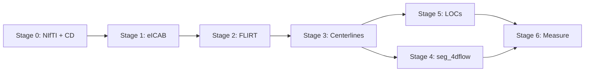
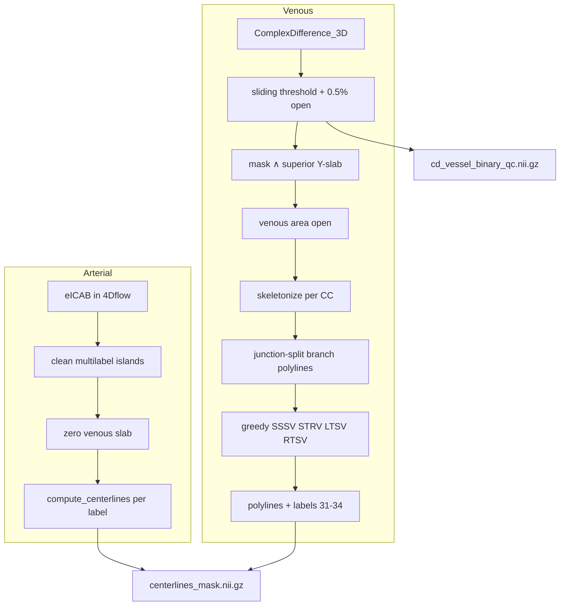
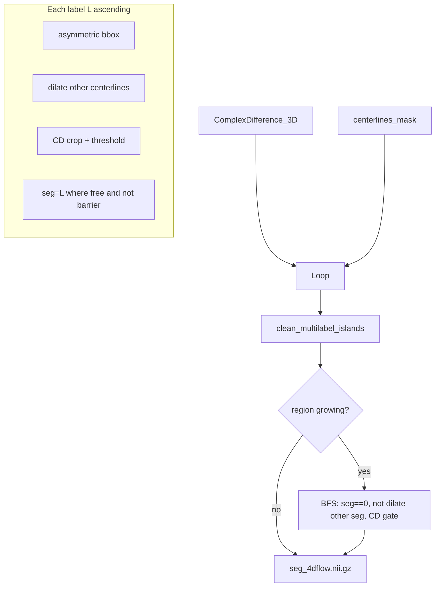

# qvtpy methodology

Pipeline implementation: `src/nvitk/pipes/qvtpy/`. This document describes **what each stage does**, **inputs and outputs**, **algorithmic choices**, and **runtime notes** (CPU vs GPU-capable array code). It reflects the current pipeline behaviour only.

---

## Overview

qvtpy is a Python-native QVT+–aligned workflow for 4D-flow MRI: DICOM/NIfTI preparation, eICAB TOF segmentation, rigid registration of labels into 4D-flow space, arterial and venous centerlines, local CD-based 3D segmentation, location-of-interest (LOC) selection, and per-LOC hemodynamics (flow, pulsatility index, resistivity index).

Typical invocation: `nvitk-qvtpy` with `--stages` selecting subsets of stages 0–6. Stages chain on disk under `--output-root/<subject>/qvtpy/`.



---

## Backend (GPU vs CPU)

nvitk selects the array stack via `NVITK_BACKEND` / `nvitk.using("cupy")` (see [`src/nvitk/core/backend.py`](../../src/nvitk/core/backend.py)). Modules that touch large volumes call `setup(globals())` and coerce data with `as_backend_array`.

| Stage / component | GPU-friendly (CuPy when backend=cupy) | CPU-only or host-bound |
|-------------------|----------------------------------------|-------------------------|
| Stage 0 convert + `phase2volume` | CD/MAG/velocity math, polynomial BG fit | NIfTI I/O; writers materialize NumPy |
| Stage 1 eICAB | — | External Singularity container |
| Stage 2 FLIRT | — | FSL `flirt` binary |
| Stage 3 centerlines | Partial: multilabel/array ops on GPU where applicable | `ndi` filters; venous **skeletonize** via scikit-image (CPU) |
| Stage 4 segmentation | Partial: CD volume ops on GPU where applicable | Local threshold (`ndi` median on crop); Otsu needs scikit-image |
| Stage 5 LOC | Light | CSV / Excel I/O |
| Stage 6 measure | Phase volumes, reductions | Per-LOC loop (small arrays) |

Any library that cannot accept CuPy arrays (notably **scikit-image** for skeletonization) uses `to_numpy(...)` before the call.

---

## Data layout (after stage 0)

Per subject under `--nifti-root`:

| Path | Content |
|------|---------|
| `TOF/TOF.nii.gz` | TOF magnitude |
| `4DFlow/{AP,RL,FH}/` | `*_m.nii.gz`, `*_ph.nii.gz`, JSON sidecars |
| `4DFlow/Angiography_3D.nii.gz` | Time-mean angiography (optional, from `phase2volume`) |
| `4DFlow/ComplexDifference_3D.nii.gz` | Complex-difference angiogram (CD) |
| `4DFlow/VelocityMagnitude_3D.nii.gz` | \|V\| (optional) |
| `4DFlow/VelocityMeanComponents.nii.gz` | Mean velocity components (optional) |

### PC phase → velocity (mm/s)

Consistent with stage 6 and [`hemodynamics.py`](../../src/nvitk/measure/hemodynamics.py):

- \(v_x = -\mathrm{RL}_{\mathrm{phase}} \times 10\)
- \(v_y = -\mathrm{AP}_{\mathrm{phase}} \times 10\)
- \(v_z = +\mathrm{FH}_{\mathrm{phase}} \times 10\)

### Complex difference (CD)

\[
\mathrm{CD} = \mathrm{MAG} \cdot \sin\left(\frac{\pi}{2}\cdot\frac{\min(|V|, \mathrm{VENC})}{\mathrm{VENC}}\right)
\]

Implementation: `_calc_angio` in [`phase2volume.py`](../../src/nvitk/io/conversors/phase2volume.py).

### Background phase correction

[`_phase2volume_bg.py`](../../src/nvitk/io/conversors/_phase2volume_bg.py): temporal mean velocity → speed percentile mask → spatial polynomial (default order **2**) in normalized coordinates \([-1,1]^3\) → subtract from mean and each frame → recompute \|V\| and CD. Fit uses `static_percentile` (default **25**) and at most **12000** voxels.

### VENC resolution

Order: JSON in `4DFlow/AP/*.json` → NIfTI metadata → optional DICOM tags → default **700** mm/s with warning.

---

## Results layout

Under `--output-root/<subject>/`:

| Directory | Main outputs |
|-----------|----------------|
| `eicab/` | eICAB multilabel NIfTI, `TOF_resampled.nii.gz` (FLIRT moving image) |
| `qvtpy/stage2_registration/` | `tof_to_4dflow.mat`, `registration_meta.json` |
| `qvtpy/stage3_centerline/` | `eicab_in_4dflow.nii.gz`, `centerlines_mask.nii.gz`, `cd_vessel_binary_qc.nii.gz`, `centerline_meta.json` |
| `qvtpy/stage4_4dflow_segmentation/` | `seg_4dflow.nii.gz`, `segmentation_meta.json` |
| `qvtpy/stage5_loc_generation/` | `locs.csv`, `locs.xlsx`, `loc_meta.json` |
| `qvtpy/stage6_measure/` | `loc_measurements.csv`, `measure_meta.json` |

### Label IDs

**Arterial (eICAB):** integers **1–18** (`EICAB_ID_TO_NAME` in `labels.py`).

**qvtpy extensions:**

| ID | Meaning |
|----|---------|
| 30 | `QVTPY_VENOUS_UNKNOWN` (reserved; not used for stage-3 venous centerlines) |
| **31** | **SSSV** (superior sagittal sinus) |
| **32** | **STRV** (straight sinus) |
| **33** | **LTSV** (left transverse sinus) |
| **34** | **RTSV** (right transverse sinus) |
| 35 | `QVTPY_UNKNOWN` |

Venous IDs are **fixed by name** (`VENOUS_LABEL_BY_NAME`); they do not depend on detection order.

---

## CLI flags (stages 3–6, `nvitk-qvtpy`)

| Flag | Stage | Default |
|------|-------|---------|
| `--eicab-mask {cw,wb}` | 3 | `cw` (warn + fallback if missing) |
| `--cd-up-thresh` | 3 | search cap 0.8×max CD |
| `--cd-shift-hm` / `--no-cd-shift-hm` | 3 | FWHM shift **on** |
| `--venous-min-component-frac` | 3 | 0.005 |
| `--eicab-min-island-fraction` | 3 | 0.005 |
| `--eicab-bridge-open-radius` | 3 | 1 |
| `--venous-min-branch-points` | 3 | 12 |
| `--crop-padding-bbox` | 4 | 3 |
| `--4dflow-thr-algorithm {lsthr,lthr,otsu}` | 4 | `lsthr` |
| `--region-growing` / `--no-region-growing` | 4 | growing **on** |
| `--rg-intensity-frac` | 4 | 0.45 |
| `--cl-barrier-radius` | 4 | 2 |
| `--rg-barrier-radius` | 4 | 3 |
| `--seg-min-island-fraction` | 4 | 0.005 |
| `--seg-bridge-open-radius` | 4 | 0 |
| `--cross-section-res`, `--cross-section-plane-interp` | 6 | 0 / 1 |
| `--loc-arterial-strategy {qvtplus,midpoint}` | 5 | `qvtplus` |
| `--cross-section-radius-vox` | 5, 6 | 10 |
| `--measure-resegment` / `--no-measure-resegment` | 6 | resegment on |

---

## Stage 0 — download / convert

- Optional XNAT download (`stage0_d`) into DICOM layout.
- **Convert** (`stage0_c`): DICOM → NIfTI, reorganize into `4DFlow/{AP,RL,FH}` and `TOF/`, optional `phase2volume` derivatives.
- Flags: `--compute-phase-derived`, `--phase-background-correction`, `--phase-bg-poly-order`, etc.

---

## Stage 1 — eICAB

TOF-based Circle-of-Willis / whole-brain multilabel segmentation (external eICAB container). Produces multilabel masks and `TOF_resampled.nii.gz` used as the **moving** image in stage 2.

---

## Stage 2 — registration (FSL FLIRT)

- **Moving:** `eicab/TOF_resampled.nii.gz` (after stage 1).
- **Fixed:** `4DFlow/Angiography_3D.nii.gz` (default) or `ComplexDifference_3D.nii.gz` (`--stage2-reference cd`).
- **Transform:** rigid (default DOF 6), cost `normmi`.
- **Outputs:** `tof_to_4dflow.mat`, warped TOF QC volume, `registration_meta.json` (`matrix`, `fixed`, `moving_kind: eicab_tof_resampled`).

---

## Stage 3 — centerlines

**Module:** `stage3_centerline.py`  
**Utilities:** `util/eicab_masks.py`, `util/flow_volume_masks.py`, `util/mask_cleaning.py`, `util/venous_heuristics.py`, `util/centerline_io.py`

Stage 3 places eICAB arterial labels in 4D-flow space, builds a global vessel mask from the complex-difference angiogram, extracts **arterial** centerlines from cleaned eICAB labels, and extracts **venous** centerlines from CD thresholding in a superior slab using geometry-based naming (SSSV, STRV, LTSV, RTSV).

### 3.1 Inputs and prerequisites

- Stage 2: `registration_meta.json` (`matrix`, `fixed` reference path).
- Stage 1: eICAB CW or WB multilabel NIfTI (`--eicab-mask`, with warn-and-fallback via `resolve_eicab_mask`).
- NIfTI: `4DFlow/ComplexDifference_3D.nii.gz` (or `.nii`).

### 3.2 Warp eICAB into 4D-flow space

eICAB labels are resampled with **nearest neighbour** using the stage-2 rigid transform:

- Output: `eicab_in_4dflow.nii.gz` (multilabel, same grid as the 4D-flow reference).

### 3.3 Global binary vessel mask (CD sliding threshold)

On the full 3D `ComplexDifference_3D` volume (`util/flow_volume_masks.binary_vessel_segment_cd`), aligned with MATLAB `slidingThreshold.m`:

1. Optional 3×3×3 median filter on CD.
2. Sweep fractional thresholds from 0 to `up_thresh` (default **0.8** of max CD) in steps of **0.001**; at each step count foreground voxels → occupancy curve.
3. Smooth the curve (moving average, width **10**), normalize, compute curvature, take the maximum-curvature index (“knee”).
4. If `--cd-shift-hm` (default **on**): shift the chosen threshold right by the FWHM width on the curvature trace (more conservative mask).
5. Binarize: `CD > opt_thresh`.
6. Remove connected components smaller than **0.5%** of total foreground (6-connectivity).

**QC output:** `cd_vessel_binary_qc.nii.gz` — the global mask before venous/arterial splitting.

Tuning: `--cd-up-thresh`, `--no-cd-shift-hm` for a more inclusive mask.

### 3.4 Arterial path (eICAB-driven)

**Goal:** centerlines for each eICAB label present outside the venous search region.

1. **Venous search slab** (`venous_search_region`): boolean mask covering the first `round(ny/3)` planes along **array axis 1** (superior portion of the volume in the stored `(nx, ny, nz)` layout).

2. **eICAB cleaning** (`clean_multilabel_islands`):
   - Per label, remove islands &lt; `eicab_min_island_fraction` (default **0.5%**) of that label’s foreground.
   - Optional per-label binary opening with ball radius `eicab_bridge_open_radius` (default **1**) to suppress thin bridges between labels.

3. **Arterial volume:** zero all voxels inside the venous slab; apply a global foreground island filter on the combined arterial mask (same 0.5% rule); write cleaned labels back to `eicab_in_4dflow.nii.gz`.

4. **Centerlines:** `compute_centerlines(arterial_vol, min_points=5)` — one ordered polyline per eICAB label id (skeleton + longest-path ordering per label).

### 3.5 Venous path (CD-driven, geometry-based)

Venous centerlines do **not** come from eICAB labels. They are derived from the CD binary mask restricted to the superior slab, then named by anatomy-inspired scoring on skeleton **branches**.

#### 3.5.1 Venous foreground mask

```
venous_mask = (cd_vessel_binary_qc > 0) ∧ venous_search_region
venous_clean = area_open(venous_mask, min_fraction=venous_min_component_frac)
```

Default `venous_min_component_frac` = **0.005** (second-pass removal of tiny islands within the slab).

#### 3.5.2 Why junction splitting is needed

If two sinuses (e.g. SSSV and RTSV) share foreground in one connected component, a single skeleton “longest path” would merge them into **one** candidate. Greedy assignment would then label the whole structure as one name (often SSSV) and drop the other.

**Solution:** after skeletonizing each connected component, split the skeleton graph at **endpoints and junctions** (voxels with skeleton degree ≠ 2). Each chain between two such nodes becomes its own **branch polyline** candidate. A T- or Y-junction between SSSV and RTSV therefore yields **two** polylines that can receive different names.

Implementation: `extract_branch_polylines` → `_branch_polylines_from_skeleton` in `util/venous_heuristics.py`.

#### 3.5.3 Branch extraction (per connected component)

For each 6-connected foreground component in `venous_clean`:

1. **Skeletonize** (`skeletonize_binary`, scikit-image, CPU).
2. Build a **26-connected** graph on skeleton voxels.
3. Mark **special nodes:** endpoints (degree 1) and junctions (degree ≥ 3); degree-2 voxels are corridor pixels.
4. From each special node, walk along degree-2 chains until the next special node; each unique chain with length ≥ `venous_min_branch_points` (default **12**) is one candidate polyline `(N, 3)` in voxel coordinates.

If the skeleton has no junctions (simple tube), one chain per component is returned. Closed loops fall back to a single longest path.

#### 3.5.4 Greedy assignment to vessel names

`assign_venous_branches` scores every unused candidate against each standard name and picks the best match per name. Processing order: **SSSV → STRV → LTSV → RTSV** (same order as fixed label ids). Each candidate can be used at most once.

**Scoring** (`_score_branch`; higher is better). All scores include a length factor: `n_points / max(nx, ny, nz)`.

| Vessel | Anatomical intent | Score components |
|--------|-------------------|------------------|
| **SSSV** | Midline sagittal, runs superior–inferior (along **z**) | `length × (0.5 × sagittal + 0.5 × \|dir_z\|)` where sagittal favors `cx` near volume midline in **x** |
| **STRV** | Oblique in **y–z**, reference direction `[0, 1, 1]` | `length × alignment(principal_dir, [0,1,1])` |
| **LTSV** | Left of midline (`cx < mid_x`), somewhat along **x** | `length × lateral_weight × (0.5 + 0.5×\|dir_x\|)`; wrong side gets lateral weight **0.2** |
| **RTSV** | Right of midline (`cx > mid_x`), somewhat along **x** | Same as LTSV with `cx > mid_x` |

**Assignment rule:** assign the highest-scoring unused candidate to the name only if `score > 0.05`; otherwise that name is **omitted**.

#### 3.5.5 Partial visibility (0–4 venous vessels)

Not all four sinuses are required. Subjects may have only SSSV, or SSSV + STRV, etc. Names without a qualifying branch are absent from:

- `venous_branches` in memory
- `centerline_meta.json` → `venous_vessels`, `venous_label_by_name`
- venous voxels in `centerlines_mask.nii.gz`

This is expected, not an error.

#### 3.5.6 Fixed label IDs

| Name | Label ID |
|------|----------|
| SSSV | 31 |
| STRV | 32 |
| LTSV | 33 |
| RTSV | 34 |

Mapped via `VENOUS_LABEL_BY_NAME` / `venous_name_to_label_id` (independent of how many vessels were detected).

### 3.6 Rasterized centerline mask and metadata

**`centerlines_mask.nii.gz`:** sparse multilabel volume:

- Arterial: eICAB label id on each arterial polyline voxel.
- Venous: fixed id **31–34** on each venous polyline voxel (venous overwrites only where arterial is 0).

**`centerline_meta.json`:** subject paths, eICAB mask resolution, `arterial_labels`, `venous_vessels`, `venous_label_by_name`, CD threshold parameters, `sliding_threshold_opt_absolute`, component-fraction settings, paths to QC and mask NIfTIs.

Stages 4–5 reload polylines via `util/centerline_io.load_centerlines` (NIfTI mask + JSON meta; **no NPZ**).

### 3.7 Stage 3 flow (summary diagram)



---

## Stage 4 — segmentation (`seg_4dflow`)

**Module:** `stage4_4dflow_segmentation.py`  
**Core logic:** `util/vessel_cd_segmentation.py`

Stage 4 builds a multilabel `seg_4dflow.nii.gz` from the full-volume **ComplexDifference_3D** and the stage-3 **centerline backbone** (`centerlines_mask.nii.gz`). It does **not** use oblique cross-section stamping or eICAB volume pasting.

### 4.1 Inputs

| Input | Role |
|-------|------|
| `4DFlow/ComplexDifference_3D.nii.gz` | Intensity volume for thresholding and region growing |
| `qvtpy/stage3_centerline/centerlines_mask.nii.gz` | Defines which labels exist and the spatial extent (bbox) of each vessel |

Every integer label `> 0` in the centerline mask is processed (qvtpy arterial ids **1–12** and venous ids **31–34**; see `labels.py`). Labels with no mask voxels are skipped.

### 4.2 Per-vessel local crop (asymmetric bbox)

Array indices `(i, j, k)` are **(X, Y, Z)**. For each label `L` (ascending order):

1. **ROI** = voxels where `centerlines_mask == L`.
2. **Bounding box** = ROI min/max on each axis, expanded per face by vessel-specific padding (base `--crop-padding-bbox`, default **3** voxels) and clamped to the volume. Effective per-face values are stored in `segmentation_meta.json` under `face_padding`.

| Vessel group | Label ids | Padding policy |
|--------------|-----------|----------------|
| ICA + Basilar | 1, 2, 3 | default on all faces except **Z+** (`pad_k_max = 0`) |
| LMCA | 6 | **X−** restricted (`pad_i_min = 0`); **X+** extra **10** vox |
| RMCA | 7 | **X+** restricted; **X−** extra **10** vox |
| ACA | 4, 5 | **X−** and **X+** restricted; **Y−** extra **10** vox |
| PCA, PComm, AComm, venous | 8–12, 31–34 | symmetric default padding |

3. **CD crop** = `CD[i0:i1+1, j0:j1+1, k0:k1+1]`.

### 4.3 Local thresholding (`--4dflow-thr-algorithm`)

Thresholding runs **inside the crop only**. Small islands below **0.5%** of crop foreground are removed before pasting.

| Algorithm | Description |
|-----------|-------------|
| **`lsthr`** (default) | 3D sliding threshold on the crop (median 3³, occupancy curve), **without** FWHM shift. |
| **`lthr`** | Same with FWHM shift (more conservative). |
| **`otsu`** | Otsu on positive crop voxels (`skimage`). |

**Centerline barrier (paste):** before writing, voxels inside a **dilated** mask of *other* vessels’ centerlines (`--cl-barrier-radius`, default **2**) are forbidden even if `seg == 0`. This reduces threshold footprints crossing neighbouring skeleton corridors.

Paste assigns `seg = L` only where `seg == 0` and not forbidden. Lower label ids still claim overlap first.

### 4.4 Per-label island cleaning

After all vessels are pasted, `clean_multilabel_islands` runs on the full `seg` volume (`--seg-min-island-fraction`, default **0.005**; optional `--seg-bridge-open-radius`). Each label’s small disconnected components are removed before region growing.

### 4.5 Region growing (`--region-growing`, default on)

Second pass (ascending label order):

1. **Seeds** = voxels with `seg == L` (after island clean).
2. **6-connected BFS** on the full CD volume. A neighbour is eligible if:
   - `seg[neighbour] == 0`
   - **not** inside `dilate(seg == other_label)` (`--rg-barrier-radius`, default **3**) — blocks growth into bright rims beside other vessels
   - `CD[neighbour] >= grow_thresh` with  
     `grow_thresh = max(mean(CD on seeds) × rg_intensity_frac, opt_thresh_local)`  
     (`--rg-intensity-frac` default **0.45**; `opt_thresh_local` from the crop threshold step).

Growing never overwrites another label id. Disable with `--no-region-growing`.

### 4.6 Outputs

| File | Content |
|------|---------|
| `seg_4dflow.nii.gz` | Multilabel 3D segmentation in 4D-flow grid |
| `segmentation_meta.json` | Global stage-4 flags + per-vessel `bbox`, `face_padding`, `opt_thresh`, voxel counts after threshold / island clean / growing |

### 4.7 Stage 4 flow (diagram)



### 4.8 Practical notes

- **Sparse centerline bbox:** per-vessel face padding limits crops extending into neighbouring territories (especially ICA/Basilar superior, MCA/ACA lateral).
- **Order effects:** ascending label id controls paste priority; barriers reduce but do not remove all order sensitivity.
- **Partial field of view:** only labels present in `centerlines_mask` are segmented.

---

## Stage 5 — LOC generation

Reads stage-3 centerlines and contrast volumes; writes `locs.csv` / `locs.xlsx`.

**Arterial** (`--loc-arterial-strategy qvtplus`, default): ICA/BA near common Z with best circularity; other arteries at masked midpoint along the polyline.

**Venous:** rebuilds a venous slab mask (CD binary ∧ superior slab, area-open) for midpoint/heuristic masks; applies QVTplus-style rules for SSSV/STRV (6-part split, SVD alignment vs `[0,1,1]`, swap validation) and LTSV/RTSV (long-segment Z-structure rules). Cross-section metrics at each LOC: `loc_circularity`, `loc_cross_section_area_mm2`.

Only vessels with stage-3 centerlines receive LOCs.

---

## Stage 6 — measurements

Per row in `locs.csv`:

1. Optional **resegment** at the LOC (`segment_at_point`) for **per-vessel** `loc_cross_section_area_mm2`.
2. Masked mean **through-plane velocity** on the oblique plane for each cardiac frame (`masked_plane_velocity_series`).
3. Flow \(Q(t) = \bar{v}_\mathrm{plane}(t) \cdot A / 1000\) ml/s; time-averaged flow and velocity; **PI** and **RI** on the flow series.

`--no-measure-resegment` can reuse area from stage 5 when present.

---

## Cluster (SGE)

`nvitk-qvtpy --submit sge` emits per-subject jobs with `-hold_jid` chaining. Container binds: `--nifti-root` → `/nvitk/data`, `--output-root` → `/nvitk/output`.

---

## Dependencies

- **FSL** (`flirt`) for stage 2: `pip install "nvitk[fsl]"` provides NiPype bindings; FSL must be on `PATH` in the runtime environment.
- **scikit-image** for stage 3 venous (and arterial) skeletonization.
- Gated FLIRT integration tests: `NVITK_FSL_TESTS=1` and `flirt` on `PATH`.
